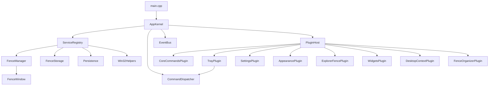

# IVOESimpleFences

[](#build-and-run)
[](#tech-stack)
[](#build-and-run)
[](#release-history)

A lightweight Win32 desktop organizer for Windows that lets you create simple desktop fences and move files into them safely.

IVOESimpleFences is focused on a clear, predictable model:

- each fence is a real desktop window
- each fence has a real backing folder on disk
- dropped files are physically moved into that fence folder
- original paths are tracked so restore can be done safely later

This project is meant to stay smaller and easier to reason about than the larger IVOE-Fences project while still prioritizing file safety, recoverability, and real desktop usefulness.

## Quick Start in 60 Seconds

If you only have a minute:

1. Open a terminal in the repository root.
2. Configure the project with CMake.
3. Build Debug.
4. Run the app.

```powershell
cmake -S . -B build -G "Visual Studio 17 2022" -A x64
cmake --build build --config Debug
.\build\bin\Debug\SimpleFences.exe
```

First run notes:

- app data is stored under `%LOCALAPPDATA%\SimpleFences\`
- fences are restored from saved config on startup
- logs are written to `%LOCALAPPDATA%\SimpleFences\debug.log`

## Current Version

Current version: `0.0.013`

## Current Status

Current phase: `0.0.013` UI shell modernization milestone, focused on cleaner settings hierarchy, reduced tab-transition repaint cost, and cohesive Windows desktop presentation.

Primary focus right now:

- keep core fence create/move/resize/drag-drop/persist/restore behavior stable
- prevent duplicate app instances and improve shutdown reliability
- keep fence create/move/resize interactions responsive and predictable
- improve drag/drop handling for duplicate and self-drop edge cases
- recover safely from malformed persisted config files
- improve icon fidelity and practical rename/edit flow
- modernize settings shell layout with explicit header/subheader/status regions
- reduce tab-transition redraw scope to the right pane for smoother switching

## What the App Does

End-user behavior:

- create draggable, resizable fence windows
- drop files and folders into a fence
- open items directly from a fence
- reload saved fences on startup
- restore items back toward their original location
- avoid destructive overwrite when restoring

Engineering goals:

- keep file behavior understandable
- prefer recovery over destructive actions
- keep state persistence simple and diagnosable
- keep the app small enough to improve safely

## How It Works

Each fence has:

- a Win32 window
- a backing folder
- saved metadata in config
- optional origin metadata for moved items

Example storage layout:

```text
%LOCALAPPDATA%\SimpleFences\
    config.json
    debug.log
    Fences\
        <FenceId>\
            _origins.json
            <items...>
```

When you drop a file into a fence:

1. the app finds or creates the fence folder
2. it tries to move the item into that folder
3. it records the original path only after the move succeeds
4. the fence refreshes to display the current contents

When you restore an item:

- the app tries to send it back to its original location
- if a file already exists there, a non-destructive name is generated instead

Example:

```text
report.txt -> report (restored 1).txt
```

When you delete a fence:

- the app first tries to restore everything inside it
- if restore is only partially successful, the fence is kept so recovery is still possible

## Safety and Recovery Behavior

Current safety rules:

- restore does not overwrite existing destination files
- failed moves do not create stale origin metadata
- partial restore failure aborts fence deletion
- config and origin data are stored as structured JSON
- metadata writes use atomic file replacement behavior on Windows
- file operation failures are logged for troubleshooting

## Current Features

- tray-based fence creation
- command-dispatched tray actions via contribution registry
- draggable and resizable fence windows
- startup reload from saved config
- file and folder drag/drop
- per-item open action
- per-item delete or restore handling
- mouse and keyboard context menu support
- logging for move, restore, delete, and persistence failures
- built-in plugin host scaffold with capability manifests
- plugin settings and fence-extension registries with status/page API exposure
- settings shell command path (`plugin.openSettings`) with scaffold UI
- fence context organization commands via plugin (`builtin.fence_organizer`)
- plugin manifest API compatibility checks (`minHostApiVersion` / `maxHostApiVersion`)
- safe command dispatch diagnostics (unknown/failed command logging)
- registry validation for menu/settings contributions (invalid and duplicate guardrails)
- host-core regression tests for command and extension registries (`HostCoreTests`)

## Known Limitations

- still early alpha
- visual design is basic
- icon fidelity and rendering polish still need work
- no installer yet
- no cloud sync
- no tabs yet
- no shell extension integration
- plugin architecture is foundation-only (placeholders for advanced providers)
- settings host uses scaffold window (full rich UI still pending)

## Repository Layout

```text
src/
    core/
        AppKernel.h/.cpp
        CommandDispatcher.h/.cpp
        EventBus.h/.cpp
        Diagnostics.h/.cpp
        ServiceRegistry.h/.cpp
    extensions/
        PluginContracts.h
        PluginHost.h/.cpp
        PluginRegistry.h/.cpp
        PluginSettingsRegistry.h/.cpp
        MenuContributionRegistry.h/.cpp
        FenceExtensionRegistry.h/.cpp
    plugins/
        builtins/
            BuiltinPlugins.h/.cpp
    App.cpp / App.h
    FenceManager.cpp / FenceManager.h
    FenceStorage.cpp / FenceStorage.h
    FenceWindow.cpp / FenceWindow.h
    Models.h
    Persistence.cpp / Persistence.h
    TrayMenu.cpp / TrayMenu.h
    Win32Helpers.cpp / Win32Helpers.h
    main.cpp
CMakeLists.txt
README.md
```

## Architecture Overview

The 0.0.011 milestone reinforces the plugin platform around a protected fence kernel.

Core rule:

- core fence behavior is not "just another plugin" yet
- plugin host grows around the core
- optional features move to plugins incrementally

Kernel/platform services now include:

- `AppKernel`: startup scaffolding for command routing, plugin host lifecycle, and failure diagnostics
- `CommandDispatcher`: command registration and isolated dispatch (`fence.create`, `app.exit`)
- `EventBus`: lightweight event pub/sub scaffold for controlled extension reactions
- `PluginHost` + registries: built-in plugin loading, capability registration, settings/menu extension points

Extension architecture details now live in [docs/EXTENSIBILITY.md](docs/EXTENSIBILITY.md).

Core fence domain remains responsible for:

- fence create/move/resize workflow
- drag/drop and file move safety
- persistence and startup reload
- restore/delete safety behavior



### Component Responsibilities

- `App`: creates stable fence services and tray shell, delegates platform-extension concerns to `AppKernel`
- `AppKernel`: owns dispatcher, event bus, plugin host, and extension registries
- `TrayMenu`: builds tray UI from menu contributions and dispatches selected commands
- `FenceManager`: canonical fence state and lifecycle coordination
- `FenceWindow`: per-fence Win32 host window and fence interaction rendering
- `FenceStorage`: physical file move/restore/delete safety and backing-folder management
- `Persistence`: structured JSON metadata with backward-compatible evolution
- `Win32Helpers`: logging, paths, and atomic metadata replacement helper operations

## Tech Stack

- C++17
- Win32 API
- CMake
- nlohmann/json
- Visual Studio / MSVC

## Build and Run

Requirements:

- Windows 10 or later
- CMake 3.16+
- Visual Studio with Desktop C++ tools

Build Debug:

```powershell
cmake -S . -B build -G "Visual Studio 17 2022" -A x64
cmake --build build --config Debug
```

Build Release:

```powershell
cmake --build build --config Release
```

Run Debug:

```powershell
.\build\bin\Debug\SimpleFences.exe
```

Run Release:

```powershell
.\build\bin\Release\SimpleFences.exe
```

## Manual Testing Checklist

Recommended checks:

- create multiple fences
- drag files and folders into a fence
- restart the app and verify fences reload correctly
- restore an item where the original location already contains a file with the same name
- delete a fence that contains several items
- inspect `debug.log` after intentional failure scenarios

## Troubleshooting

### The app starts but I do not see expected behavior

Check:

- whether another instance is already running
- whether `%LOCALAPPDATA%\SimpleFences\config.json` is malformed
- whether `debug.log` contains startup or tray errors

### A file did not move or restore correctly

Check:

- source and destination path permissions
- whether another process is locking the file
- `debug.log` for move/copy/remove details

### A fence did not disappear when I deleted it

This can happen intentionally if restore was only partially successful. The fence is kept so remaining items can still be recovered safely.

## Release History

### 0.0.013

- modernized settings shell structure with dedicated title, subtitle, and status regions
- improved visual hierarchy and spacing of navigation versus content regions
- reduced tab-switch repaint work to right content pane to improve responsiveness
- kept existing settings behavior and persistence semantics intact

### 0.0.012

- added single-instance startup guard with user-facing warning and clean mutex teardown
- implemented practical fence rename workflow from the fence context menu
- hardened drag/drop routing to deduplicate paths and skip self-drops from the same fence folder
- improved corrupted metadata recovery by quarantining malformed config and continuing startup
- aligned icon list loading to large icon rendering for better icon fidelity
- expanded host core tests with persistence corruption recovery coverage

### 0.0.011

- added versioned plugin contract compatibility bounds in manifest (`minHostApiVersion` / `maxHostApiVersion`)
- hardened plugin host loading with manifest validation, duplicate-id rejection, and exception isolation
- added safer command dispatcher behavior with collision checks and exception-safe dispatch results
- added command execution diagnostics for unknown commands and command handler failures
- hardened menu and settings registries with contribution validation and deterministic duplicate handling
- improved settings-store load compatibility for legacy flat JSON format
- added focused host infrastructure regression tests (`HostCoreTests`) and wired CTest execution
- documented plugin-first host responsibilities in `docs/EXTENSIBILITY.md`

### 0.0.010

- added settings host scaffold path with General, Plugins, and Diagnostics pages
- exposed plugin status and settings-page registration through kernel APIs
- added plugin diagnostics logging for loaded/failed/capability reporting
- introduced content-provider registry lookup/default resolution with core `file_collection` fallback
- normalized persisted fence provider defaults to `core.file_collection`
- kept existing core fence workflow as stable kernel behavior

### 0.0.009

- introduced `AppKernel` platform layer around stable fence core behavior
- added command dispatcher and routed tray actions via `fence.create` and `app.exit`
- added plugin host, plugin contracts, and built-in plugin manifests
- added menu contribution, settings registry, and fence-extension registry scaffolding
- evolved persistence/model to include content-provider metadata with backward compatibility
- documented phased migration from monolith to plugin-capable platform

### 0.0.008

- wrote origin metadata only after successful move completion
- replaced delete-then-rename save flow with stronger atomic replacement behavior
- prevented fence deletion when restore only partially succeeded
- added proper keyboard-compatible context menu handling
- reused cached image list during painting
- improved logging detail for file operation failures

### 0.0.007

- migrated persistence to structured JSON
- removed hardcoded per-user log paths
- centralized restore and delete behavior
- added structured move results
- added non-destructive restore naming
- improved geometry persistence
- improved long-path drag/drop handling
- improved shutdown cleanup

### 0.0.006 and earlier

- established the base fence workflow, storage model, persistence, and desktop interaction foundation

## Roadmap

Phase A: Platform foundation

- complete kernel service registration boundaries and diagnostics surfaces
- keep core file-collection fence flow stable and first-class
- mature plugin status reporting and plugin failure handling UX
- evolve settings scaffold from shell to rich multi-page window

Phase B: Built-in plugin migration

- move tray behavior ownership fully into tray plugin while preserving command-driven routing
- deliver appearance plugin basics and theme hooks for fence rendering
- add plugin management settings page for enable/disable and health visibility

Phase C: Advanced plugin capabilities

- extract file collection behavior into default provider contract
- prototype `folder_portal` provider through Explorer fence plugin
- prototype `widget_panel` provider through widgets plugin
- define desktop context integration path before any shell-extension rollout

Near-term quality work across phases:

- improve icon accuracy and rendering polish
- finish rename UI
- keep hardening filesystem edge cases
- improve user-visible error feedback beyond logs

Later:

- better layout and item presentation
- customization options
- stronger keyboard and accessibility support
- packaging and installer flow

## Contributing

Best contributions right now:

- Win32 correctness fixes
- file-safety improvements
- UI polish
- reproducible edge-case tests
- build and runtime verification

Recommended workflow:

1. make a small focused change
2. build the project
3. run the app
4. verify file move, restore, and startup behavior
5. update README when behavior changes

## Notes

`IVOE-Fences` is the broader and more advanced project.

`IVOESimpleFences` is the simpler, more direct project focused on a smaller Win32 fence implementation with strong emphasis on safe file handling and recoverable behavior.
