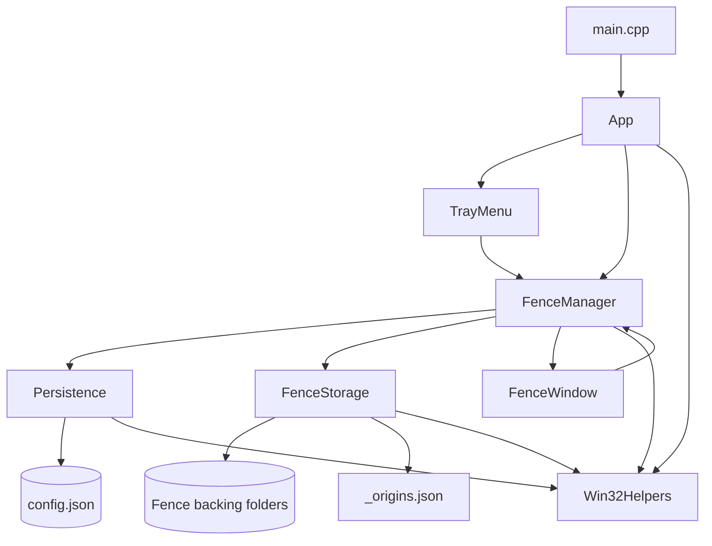

# IVOESimpleFences

[](#build-and-run)
[](#tech-stack)
[](#build-and-run)
[](#release-history)

A lightweight Win32 desktop organizer for Windows that lets you create simple desktop fences and move files into them safely.

IVOESimpleFences is focused on a clear, predictable model:

- each fence is a real desktop window
- each fence has a real backing folder on disk
- dropped files are physically moved into that fence folder
- original paths are tracked so restore can be done safely later

This project is meant to stay smaller and easier to reason about than the larger IVOE-Fences project while still prioritizing file safety, recoverability, and real desktop usefulness.

## Quick Start in 60 Seconds

If you only have a minute:

1. Open a terminal in the repository root.
2. Configure the project with CMake.
3. Build Debug.
4. Run the app.

```powershell
cmake -S . -B build -G "Visual Studio 17 2022" -A x64
cmake --build build --config Debug
.\build\bin\Debug\SimpleFences.exe
```

First run notes:

- app data is stored under `%LOCALAPPDATA%\SimpleFences\`
- fences are restored from saved config on startup
- logs are written to `%LOCALAPPDATA%\SimpleFences\debug.log`

## Current Version

Current version: `0.0.008`

## Current Status

Current phase: early alpha focused on making the core fence workflow safe and reliable before expanding features.

Primary focus right now:

- safer file move and restore behavior
- reliable persistence and startup restore
- stronger delete recovery behavior
- more accurate icon handling and better Win32 polish
- clearer logs and diagnostics for real-world desktop testing

## What the App Does

End-user behavior:

- create draggable, resizable fence windows
- drop files and folders into a fence
- open items directly from a fence
- reload saved fences on startup
- restore items back toward their original location
- avoid destructive overwrite when restoring

Engineering goals:

- keep file behavior understandable
- prefer recovery over destructive actions
- keep state persistence simple and diagnosable
- keep the app small enough to improve safely

## How It Works

Each fence has:

- a Win32 window
- a backing folder
- saved metadata in config
- optional origin metadata for moved items

Example storage layout:

```text
%LOCALAPPDATA%\SimpleFences\
    config.json
    debug.log
    Fences\
        <FenceId>\
            _origins.json
            <items...>
```

When you drop a file into a fence:

1. the app finds or creates the fence folder
2. it tries to move the item into that folder
3. it records the original path only after the move succeeds
4. the fence refreshes to display the current contents

When you restore an item:

- the app tries to send it back to its original location
- if a file already exists there, a non-destructive name is generated instead

Example:

```text
report.txt -> report (restored 1).txt
```

When you delete a fence:

- the app first tries to restore everything inside it
- if restore is only partially successful, the fence is kept so recovery is still possible

## Safety and Recovery Behavior

Current safety rules:

- restore does not overwrite existing destination files
- failed moves do not create stale origin metadata
- partial restore failure aborts fence deletion
- config and origin data are stored as structured JSON
- metadata writes use atomic file replacement behavior on Windows
- file operation failures are logged for troubleshooting

## Current Features

- tray-based fence creation
- draggable and resizable fence windows
- startup reload from saved config
- file and folder drag/drop
- per-item open action
- per-item delete or restore handling
- mouse and keyboard context menu support
- logging for move, restore, delete, and persistence failures

## Known Limitations

- still early alpha
- visual design is basic
- rename workflow is not fully implemented in the UI
- icon fidelity and rendering polish still need work
- no installer yet
- no cloud sync
- no advanced sorting, tabs, or portal fences
- no shell extension integration

## Repository Layout

```text
src/
    App.cpp / App.h
    FenceManager.cpp / FenceManager.h
    FenceStorage.cpp / FenceStorage.h
    FenceWindow.cpp / FenceWindow.h
    Models.h
    Persistence.cpp / Persistence.h
    TrayMenu.cpp / TrayMenu.h
    Win32Helpers.cpp / Win32Helpers.h
    main.cpp
CMakeLists.txt
README.md
```

## Architecture Overview

IVOESimpleFences is intentionally small and direct. The project is built around a few focused components:

- `App`: startup, shutdown, message loop, and top-level wiring
- `TrayMenu`: tray icon and user commands like creating a fence or exiting
- `FenceManager`: owns the canonical fence models and coordinates windows, storage, and persistence
- `FenceWindow`: one Win32 window per fence, responsible for painting and user interaction
- `FenceStorage`: move, restore, delete, and backing-folder/origin metadata behavior
- `Persistence`: load/save of fence config
- `Win32Helpers`: app-data paths, logging, and atomic file replacement helpers



### Component Responsibilities

#### App

Responsible for:

- initializing common controls
- creating storage, persistence, manager, and tray objects
- loading saved fences
- running the Win32 message loop
- performing ordered shutdown

#### TrayMenu

Responsible for:

- tray icon creation
- tray menu display
- routing high-level commands such as create new fence and exit application

#### FenceManager

Responsible for:

- owning the canonical list of fences
- creating and deleting fences
- refreshing fence contents
- updating fence geometry
- deciding whether fence deletion is safe after restore attempts
- coordinating between UI, storage, and persistence

#### FenceWindow

Responsible for:

- rendering a fence window
- handling drag/drop
- painting icons and item labels
- item interaction
- context menus
- notifying the manager when geometry or actions change

#### FenceStorage

Responsible for:

- creating fence folders
- scanning fence contents
- moving dropped items into fences
- recording original item locations
- restoring items safely
- cleaning up fence folders when appropriate

#### Persistence

Responsible for:

- loading fence metadata from `config.json`
- saving fence metadata back to disk
- using structured JSON and atomic replacement behavior

#### Win32Helpers

Responsible for:

- resolving app-data paths
- logging
- low-level Win32 helper functions
- atomic metadata file replacement

## Tech Stack

- C++17
- Win32 API
- CMake
- nlohmann/json
- Visual Studio / MSVC

## Build and Run

Requirements:

- Windows 10 or later
- CMake 3.16+
- Visual Studio with Desktop C++ tools

Build Debug:

```powershell
cmake -S . -B build -G "Visual Studio 17 2022" -A x64
cmake --build build --config Debug
```

Build Release:

```powershell
cmake --build build --config Release
```

Run Debug:

```powershell
.\build\bin\Debug\SimpleFences.exe
```

Run Release:

```powershell
.\build\bin\Release\SimpleFences.exe
```

## Manual Testing Checklist

Recommended checks:

- create multiple fences
- drag files and folders into a fence
- restart the app and verify fences reload correctly
- restore an item where the original location already contains a file with the same name
- delete a fence that contains several items
- inspect `debug.log` after intentional failure scenarios

## Troubleshooting

### The app starts but I do not see expected behavior

Check:

- whether another instance is already running
- whether `%LOCALAPPDATA%\SimpleFences\config.json` is malformed
- whether `debug.log` contains startup or tray errors

### A file did not move or restore correctly

Check:

- source and destination path permissions
- whether another process is locking the file
- `debug.log` for move/copy/remove details

### A fence did not disappear when I deleted it

This can happen intentionally if restore was only partially successful. The fence is kept so remaining items can still be recovered safely.

## Release History

### 0.0.008

- wrote origin metadata only after successful move completion
- replaced delete-then-rename save flow with stronger atomic replacement behavior
- prevented fence deletion when restore only partially succeeded
- added proper keyboard-compatible context menu handling
- reused cached image list during painting
- improved logging detail for file operation failures

### 0.0.007

- migrated persistence to structured JSON
- removed hardcoded per-user log paths
- centralized restore and delete behavior
- added structured move results
- added non-destructive restore naming
- improved geometry persistence
- improved long-path drag/drop handling
- improved shutdown cleanup

### 0.0.006 and earlier

- established the base fence workflow, storage model, persistence, and desktop interaction foundation

## Roadmap

Near term:

- improve icon accuracy and rendering polish
- finish rename UI
- keep hardening filesystem edge cases
- improve user-visible error feedback beyond logs

Later:

- better layout and item presentation
- customization options
- stronger keyboard and accessibility support
- packaging and installer flow

## Contributing

Best contributions right now:

- Win32 correctness fixes
- file-safety improvements
- UI polish
- reproducible edge-case tests
- build and runtime verification

Recommended workflow:

1. make a small focused change
2. build the project
3. run the app
4. verify file move, restore, and startup behavior
5. update README when behavior changes

## Notes

`IVOE-Fences` is the broader and more advanced project.

`IVOESimpleFences` is the simpler, more direct project focused on a smaller Win32 fence implementation with strong emphasis on safe file handling and recoverable behavior.
